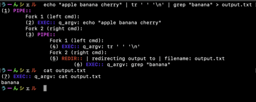

# 42minishell

## My own little bash


This is a simple **Bash**-like shell implemented from scratch. It aims to replicate the functionality of **Bash** as closely as possible.

The shell parses and interprets user input, executes commands with arguments, and implements essential shell features such as **redirection**, **piping**, and handling **environment variables**. Searches for executables in the ```PATH``` environment variable. Includes a fully functional command history feature, allowing users to navigate through previously entered commands directly from the prompt.

It features some built-in commands:
  - ```echo```
  - ```cd```
  - ```pwd```
  - ```export```
  - ```unset```
  - ```env```
  - ```exit```

It supports these redirections:
  - ```<```
  - ```>```
  - ```>>```
  - ```<<``` (heredoc)

The pipe ```|``` is also supported. Environment variables are parsed and expanded to their values, also handling variable substitution in commands.

Supports single quotes ```'```, which prevent the shell from interpreting any metacharacters within the quoted sequence, and double quotes ```"```, which do the same except for allowing interpretation of the dollar sign ```$```.

The signals ```Ctrl+C```, ```Ctrl+D```, and ```Ctrl+\``` are managed accordingly. Invalid commands and syntax are handled gracefully with appropriate error messages.
I also made it possible to get a visualization of the parsed command tree as executable nodes.

As bonus, the following features are supported as well:
  - Logical operators ```&&``` and ```||```
  - Command grouping with parentheses ```(command1 && command2) || command3```
  - Wildcards for filename matching ```*```

This was my eighth project in **Hive Helsinki** and it introduced several foundational and advanced concepts related to system programming, operating systems, and shell functionalities.
I actually completed this task in late **2023**, but I wanted to redo the commit history and make some minor changes.

## 📖 Topics
  - Parsing and tokenization
  - System calls
  - Shell basics
  - Redirections and pipes
  - Signal handling
  - File descriptors
  - Process management
  - Memory management
  - Error handling
  - Unit testing

## 🛠️ Langs/Tools
  - C
  - Makefile

## 🦉 Getting started

  1. ```git clone https://github.com/kenlies/42minishell```
  2. ```cd 42minishell```
  3. ```make```
  4. ```./minishell```

     **or**

     ```./minishell 1``` for visualizing the command execution tree:

     

## 💸 Bonus section

The bonus requirements included support for logical operators, command grouping with parentheses, and wildcard handling. From the beginning, I aimed to implement all the bonus features, which influenced me to structure the entire implementation around the concept of command grouping. My solution involved building a tree structure for the commands, which is then traversed to execute each command in the correct order.

## 🔨 To improve

I would redesign the parser to optimize memory usage by minimizing redundant allocations and deallocations, while maintaining the current standard of proper memory management and freeing. The command execution tree could be illustrated better.

